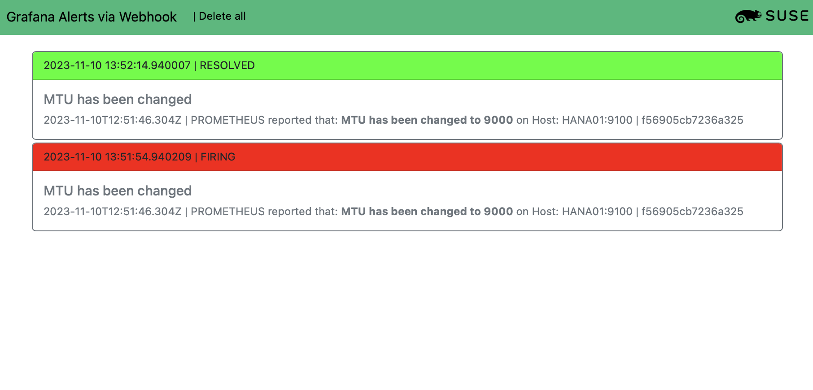

# Grafana Webhook

When working on alert rules in Grafana the convenient way to send alerts is vial mail. 
If you however have a local test environmend, this is often not that easy to implement.
During the SUSE Hackweek in November 2023 a idea come up to send alerts via the webhook
implemantation on Grafana Alertmanager. 

Grafana_Webhook is implemented via python3, Flask and Bootstrap stylesheet. 



## Installation

The following python modules are needed:

* pip install flask
* pip install SQLAlchemy
* pip install flask_sqlalchemy

Clone the repository and run the main.py:

```python3 main.py```

Grafana_Webhook can than be acceesed under:

```http://<IP>:8080/webhook```

### NOTE: 
**The code is currently only a Proof of Concept. It works only on a specific prometheus alert rule (see below). Any other rule might failed because some labels and variables are not known by the code.**


Working alertmanager rule:

```
groups:
  - name: Wrong MTU
    rules:
      # To test the alert simply do:
      # ip link set mtu 9000 dev lo
      # Default is: 65536
      - alert: mtu
        expr: node_network_mtu_bytes{device="lo"} == 9000
        for: 15s
        labels:
        annotations:
          title: MTU has been changed
          description:  MTU has been changed to 9000
``````


## ToDo:
Make the code more dynamically that rules with different labels can be used.

